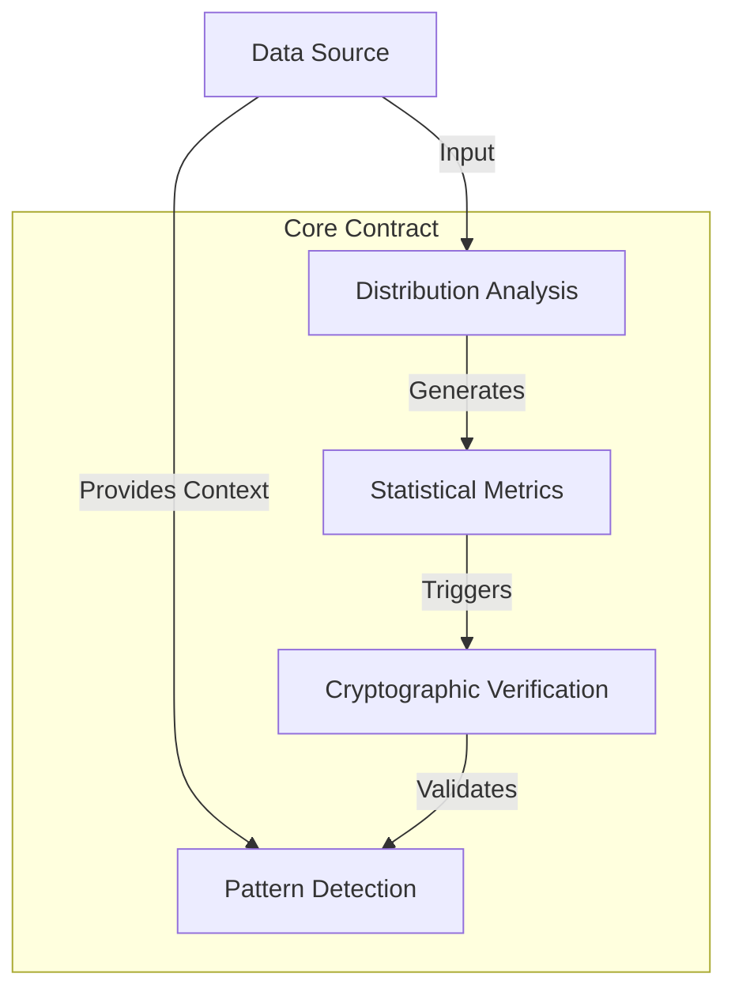

# Pedersen Detector

A blockchain-native solution for detecting statistical distribution patterns using cryptographic techniques.

## Overview

Pedersen Detector is an advanced blockchain tool designed to:
- Analyze data distribution patterns
- Implement cryptographic verification techniques
- Enable secure and transparent statistical analysis
- Build robust pattern detection mechanisms

The platform leverages blockchain's immutability to create a reliable, tamper-proof system for detecting and studying complex data distributions.

## Architecture

The system is built around a core smart contract that manages:
- Pattern detection algorithms
- Statistical distribution tracking
- Cryptographic verification
- Secure data analysis mechanisms



## Contract Documentation

### Core Contract (pedersen-detector.clar)

The main contract implementing advanced pattern detection and statistical analysis.

#### Key Features
- Advanced distribution pattern recognition
- Cryptographic verification of statistical metrics
- Secure data analysis techniques
- Transparent and immutable tracking

#### Detection Strategies
1. Statistical Distribution Analysis
2. Cryptographic Verification
3. Pattern Recognition
4. Metric Computation

#### Analysis Techniques
- Probabilistic Detection
- Cryptographic Comparison
- Statistical Sampling
- Secure Computation

## Getting Started

### Prerequisites
- Clarinet
- Stacks wallet for contract interaction

### Basic Usage

1. Record a meditation session:
```clarity
(contract-call? .zensync-core record-meditation-session 
    u30  ;; duration in minutes
    u1   ;; meditation type (1 = mindfulness)
    none ;; optional notes
)
```

2. Create a meditation group:
```clarity
(contract-call? .zensync-core create-meditation-group 
    "Morning Meditators" 
    "A group for early risers"
)
```

## Function Reference

### Public Functions

#### record-meditation-session
```clarity
(define-public (record-meditation-session (duration uint) (meditation-type uint) (notes (optional (string-utf8 256))))
```
Records a new meditation session and triggers achievement checks.

#### create-meditation-group
```clarity
(define-public (create-meditation-group (name (string-utf8 64)) (description (string-utf8 256)))
```
Creates a new meditation group with the caller as creator.

#### join-meditation-group
```clarity
(define-public (join-meditation-group (group-id uint))
```
Allows a user to join an existing meditation group.

#### verify-achievement
```clarity
(define-public (verify-achievement (achievement-id uint))
```
Publicly verifies an achievement's authenticity.

### Read-Only Functions

#### get-user-stats
```clarity
(define-read-only (get-user-stats (user principal))
```
Retrieves complete statistics for a user.

#### get-meditation-session
```clarity
(define-read-only (get-meditation-session (user principal) (timestamp uint))
```
Retrieves details of a specific meditation session.

## Development

### Testing
1. Install Clarinet
2. Run the test suite:
```bash
clarinet test
```

### Local Development
1. Start a local Clarinet console:
```bash
clarinet console
```
2. Deploy contracts:
```clarity
(contract-call? .zensync-core ...)
```

## Security Considerations

### Limitations
- Group membership limited to 100 members per group
- Achievement list capped at 100 achievements per user
- Meditation types list limited to 10 types

### Best Practices
- Verify achievement ownership before sharing
- Check group membership before attempting group operations
- Validate all duration and meditation type inputs
- Be aware of streak calculation limitations around time zones